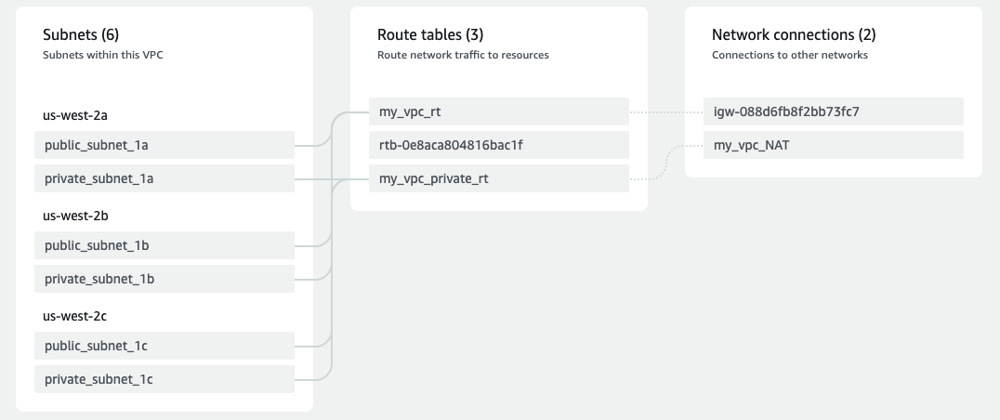

# Terraform VPC
Little terraform to play around with aws VPC concepts
like VPC peering, VPC endpoints, Loadbalancers, VPNs e.t.c

## Description
Just a simple terraform to create a VPC on aws
The VPC has 3 private and public subnets each in
separate availability zones.

## Todo
- Code improvements
- Add EC2 instances (at least one in a private and public subnet)
- Add security groups and rules for each instance
- Configure NAT gateway for instance/s in private subnet

## Map of VPC

